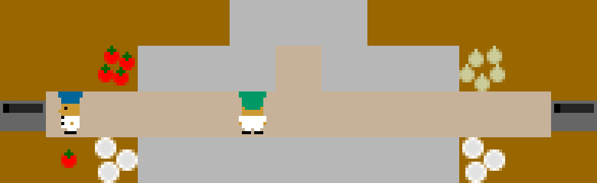
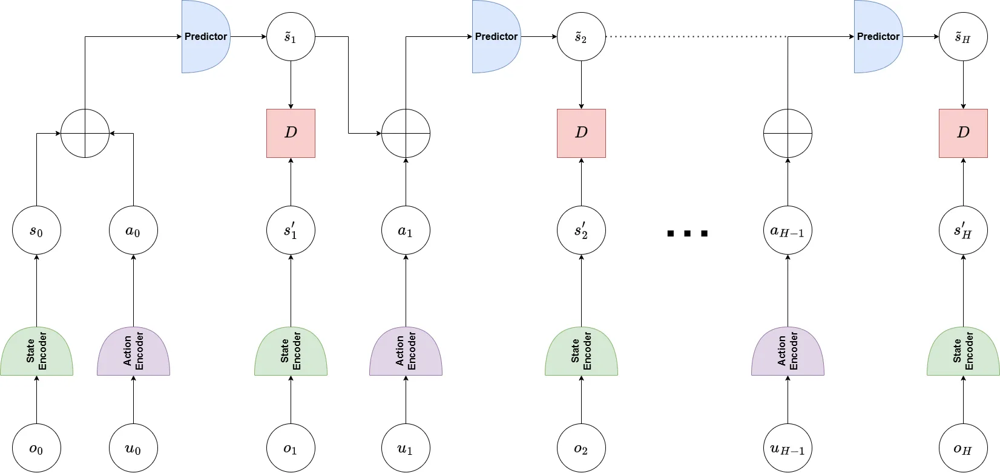
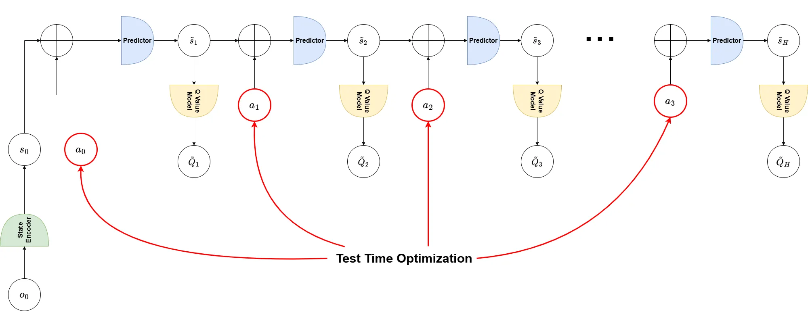
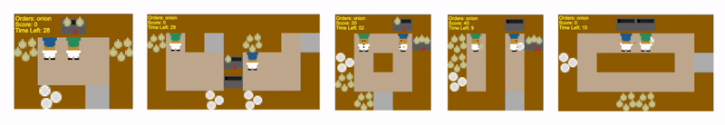
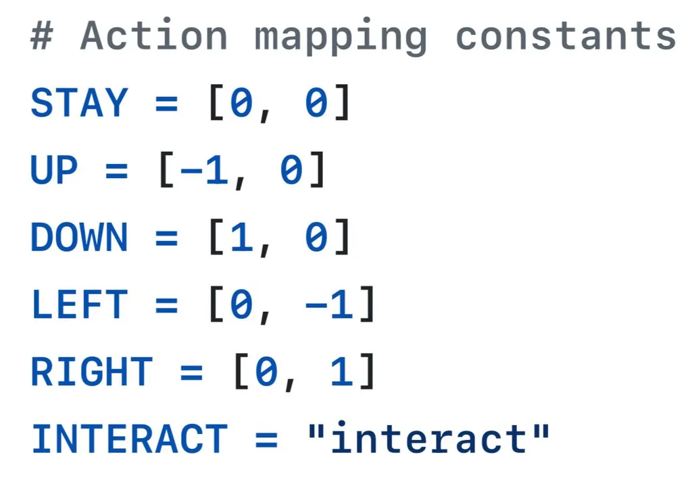
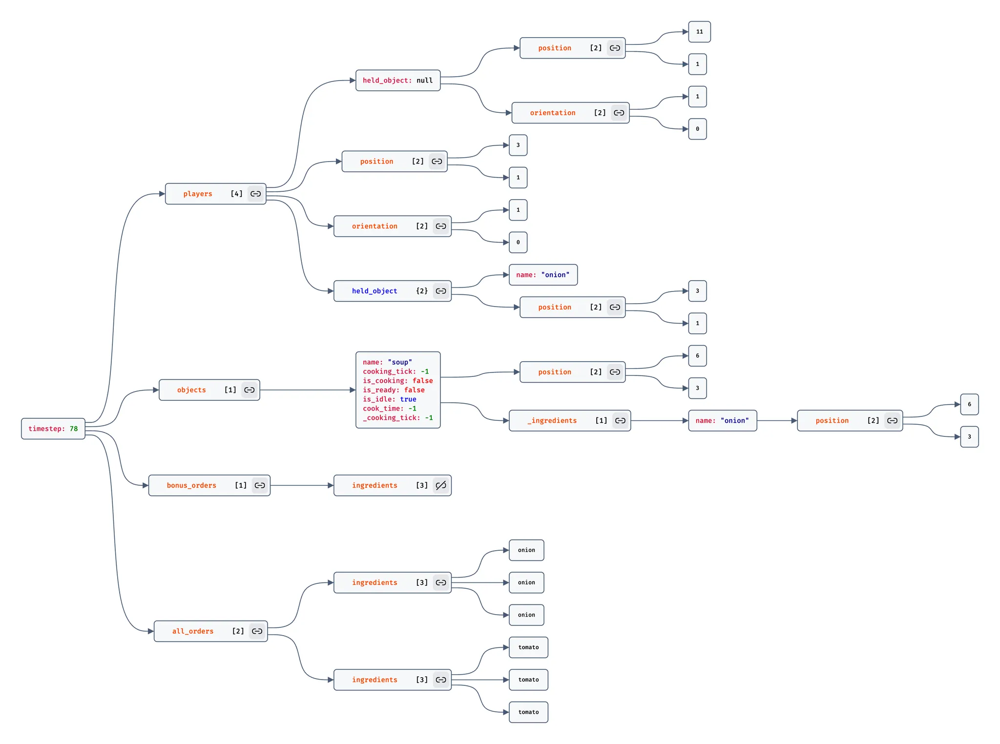

# Latent Dynamics Planning for Cooperative MARL in Overcooked-AI

### Harsh Sutaria | Kevin Mathew | Ayush Rajesh Jhaveri | Tiasa Singha Roy

## Abstract

In this work, we systematically evaluate a **Latent Dynamics Model**, trained on offline human-generated trajectories within the **Overcooked-AI** cooperative environment. We combine latent dynamics modeling with **Model Predictive Path Integral (MPPI)** style planning and compare it against a planning-free baseline. Our experiments reveal that although our approach improves on the greedy baseline, it significantly trails expert-level performance. We identify critical challenges, including sparse reward feedback and cumulative prediction errors during long-horizon planning. Our findings underscore that while latent dynamics-based planning shows promise in data-efficient generalization and improved cooperative decision making from limited offline data, substantial opportunities remain for enhancing model accuracy and planning efficacy in highly cooperative and sparse reward scenarios.

## Background & Motivation

A key challenge in cooperative multi-agent reinforcement learning (MARL) is developing agents capable of coordinating effectively in complex environments from limited offline data. Two primary approaches to address this are:

- model-free methods that learn directly from experiences using value-based policies
- model-based planning methods, which leverage learned latent dynamics to predict future states and optimize decisions.

However, the relative effectiveness of these approaches, particularly when using offline expert trajectories in sparse reward, cooperative scenarios, remains under-explored.

---

## Training and Planning with Dynamics Model

### Stage 1: Latent Dynamics Training

- JEPA-style latent dynamics model trained using offline trajectories.
- Learned representation aimed to capture environment dynamics effectively from sparse, discrete state-action data.

---

### Stage 2: Q-Value Model Training

- Trained a Q-value predictor to evaluate state-action pairs within the learned latent space.
- Used MPPI-based planning to generate trajectories by simulating actions based on the learned dynamics model.

---

### Stage 3: MPPI Style Planning

- Although MPPI is typically used for continuous control, we use its adapted version for **discrete action spaces**.
- Randomly sampled multiple action trajectories.
- Used cumulative predicted Q-values as weights.
- At each timestep, aggregated Q-values and selected the action with the highest corresponding value.

---

## Environments and Datasets

- **Environment**: Overcooked-AI — a cooperative multi-agent simulation where two agents coordinate to prepare and deliver dishes in a shared kitchen.

- **Dataset**: Expert trajectories from human-human interactions.
    - Stored as DataFrames containing:
        - State transitions
        - Joint actions
        - Rewards

Each trajectory represents a sequence of cooperative actions culminating in high rewards.

---

## Experimental Setup

- Implemented **VICReg-style loss** to prevent representation collapse.
- Fine-tuned VICReg parameters via **Random Grid Search** (100 trials).
- MPPI-based planning hyperparameters:
    - Explored various combinations of:
        - **Planning horizon** (length of rollout)
        - **Number of samples** (rollouts per step)

---

## Results

| **Model / Method** | **Avg. Reward** |
| --- | --- |
| Expert Performance | ~150 |
| Greedy Baseline | 13 |
| PLDM + MPPI Planning | 26 |
- Configuration: `num_samples = 100`, `planning_horizon = 10`

Although the latent dynamics model improved performance over the greedy baseline, it still lags behind human-level coordination.

---

## Summary

While PLDM-based latent state modeling combined with MPPI-style planning demonstrates **potential in cooperative MARL**, a **significant performance gap** remains when compared to human-level performance.

### Key Takeaways

- **Sparse Rewards Challenge**:
    
    Sparse rewards severely limit planning feedback. Denser reward signals or shaping are needed.
    
- **Model Prediction Errors**:
    
    Inaccuracies in the dynamics model lead to **cumulative error** in multi-step rollout.
    
- **Planning Horizon and Sampling**:
    
    More accurate shorter horizons may outperform long horizons.
    
    **Effective sampling** is critical.
    
- **Enhanced Exploration Strategies**:
    
    Techniques like **intrinsic motivation** or **curiosity-driven rewards** could help in sparse-reward settings.
    

---

## Future Work

- Improve latent dynamics **model accuracy**
- Incorporate **denser reward feedback**
- Optimize **MPPI sampling and rollout strategy**
- Explore **representation regularization** for generalization
- Consider **multi-goal inference and attention-based planning**